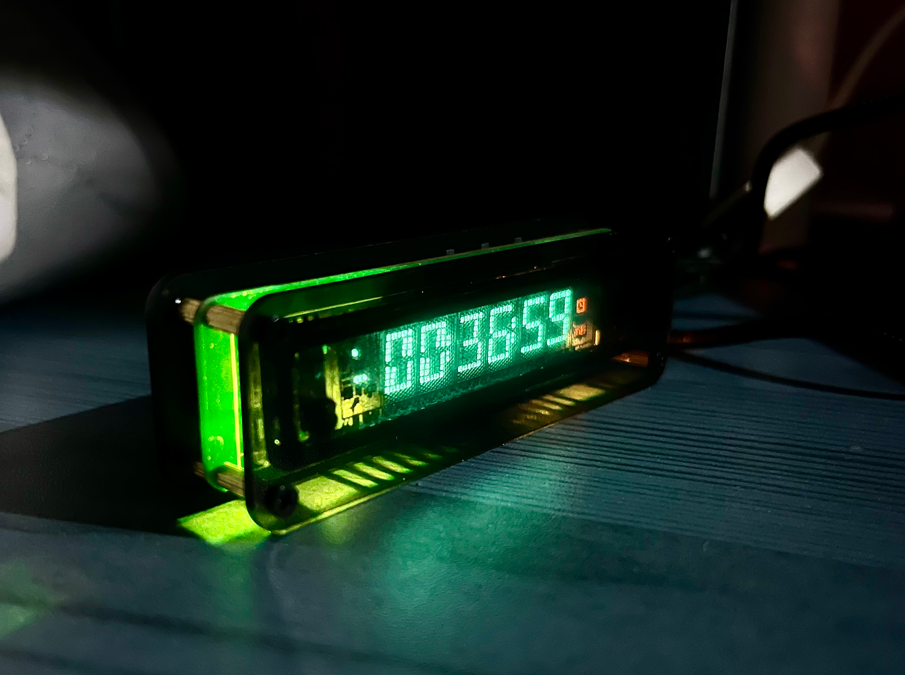
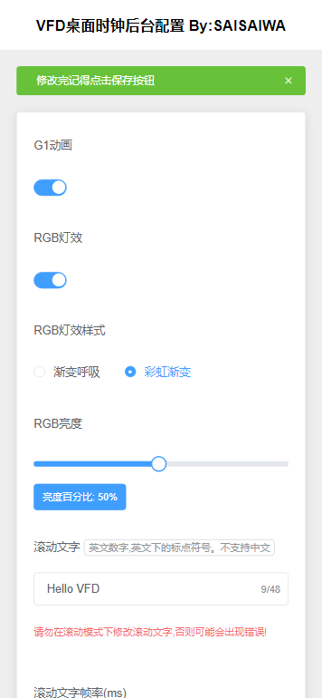

# CCY-VFD-7BT317NK

updated to work with AiExpress version.


> VFD Screen 7-BT-317NK Driver, Main Controller ESP8266, Driver IC PT6315

Gitee Repository: https://gitee.com/Jack-chendeng/CCY-VFD-7BT317NK

Github Repository: https://github.com/ccy-studio/CCY-VFD-7BT-317NK

Development Environment: Arduino, PlatformIO

VFD driver PT6315 driver program, used for driving a homemade VFD clock project.

Main controller ESP-12S Anxin module, integrated with WIFI configuration and automatic time calibration for a desktop time display project.

Blog: www.saisaiwa.com

VFD Screen WIFI Clock Hardware Open Source Link: http://www.saisaiwa.com/archives/vfd-clock-7-BT-317NK

VFD Screen PT6315 Driver Timing: http://www.saisaiwa.com/archives/pt6315-code-jangj

Discussion Group: http://www.saisaiwa.com/about

This project is a PlatformIO project. Due to some friends' computers lacking the environment or network issues causing installation failures, a cloud compilation method is provided here. This method uses a cloud Docker container to achieve rapid compilation of the required .bin files for burning. 
For detailed operation instructions, please see: http://www.saisaiwa.com/archives/1691566266606

User Manual: http://www.saisaiwa.com/archives/vfd-clock-userdescription

The doc folder contains some necessary resource files.



``V3 Version Image``

## 1. Version Iteration Records

### V3 Version - latest

#### release-3.0

- Added WEB management page
  - Built-in WebServer service, port 80
  - Added HTML page code (non-local JS, CSS files require WIFI connection)
  - Front-end and back-end separation design
- Added RGB lighting module
- Added passive buzzer module
- Major code refactoring, optimized stability
- Automatic power on/off
- Alarm clock function
- Timer function
- Buttons can control WIFI switch (long press + button, wait 1 second, then press - button) for two-way cycle switching
- FN button added to switch to the current WIFI IP address display page (switch in order)
- Added automatic interval and initial time configuration for network time synchronization
- Scrolling text can be dynamically modified
- Scrolling text frame rate can be dynamically modified
- Added 3 new RGB effects
- RGB brightness can be dynamically adjusted
- RGB can be configured to turn on/off
- G1 animation dynamic configuration switch
- Storage module LittleFS file storage
- OTA online upgrade



### V1 Board

https://oshwhub.com/yc_chen/vfd-317nk-qu-dong-ban

#### release - 1.0

- WIFI configuration
- Network time calibration
- Button to switch display style and content

Operation Method

- Short press button 1 to turn on/off LED
- Long press button 1 for two seconds and release to reset WIFI and automatically restart
- Short press button 2 to increase brightness
- Short press button 3 to decrease brightness

#### release - 1.1 (20230812)

New Features
- Long text scrolling display
- Long text loop playback
- Added G1 segment animation effect
- Refactored font library logic
- Added more ASCII font library support
- Optimized stability

---

### V2 Board
https://oshwhub.com/yc_chen/v2-vfd-7-bt-317nk-wifi-shi-zhong

#### release-v2.0

New Features
- Long text scrolling display
- Long text loop playback
- Added G1 segment animation effect
- Refactored font library logic
- Added more ASCII font library support
- Optimized stability
- V2 new circuit with dedicated PWM support

The first time you burn the program, it will prompt you to configure the network. By default, it will open the AP hotspot and display (ap-run). Search for the hotspot starting with ``VFD-`` on your phone, connect directly without a password. Normally, a configuration page will pop up.
If the page does not pop up, please enter ``192.168.4.1`` in the browser to configure the network.
After successful configuration, it will automatically connect to WIFI and restart. If the configuration fails, it will restart and reopen the AP hotspot.
If there is no operation for a long time in the configuration state, the system will timeout and enter a dead loop, and the screen will display an error message. At this time, please manually restart.

### 2. Driver Library Usage Steps

1. First, you need to include the library file

   ```c
   #include <gui.h>
   ```

2. Initialize in the Setup method of the Main method

   ```c
   // Initialize VFD
   ptInitGPIO();
   delay(3000);
   vfd_gui_init();
   ```

API GUI Operation Methods

```c

/**
 * Initialize
 */
void vfd_gui_init();

/**
 * Stop and turn off the display, the filament will stop driving
 */
void vfd_gui_stop();

/**
 * Clear the VFD screen display, loop refresh. If using vfd_gui_set_text method, this is not needed.
 */
void vfd_gui_clear();

/**
 * Display a char character at the specified position, index from 1~6
 */
void vfd_gui_set_one_text(size_t index, char oneChar);

/**
 * Display a string of text starting from position 0.
 * (Automatically clear and overwrite display, convenient to avoid calling clear each time to prevent screen flicker)
 */
u8 vfd_gui_set_text(const char* string);

/**
 * Light up the ICON icon, pass macro definition as parameter
 * @param is_save_state Whether to save this ICON icon to a variable
 */
void vfd_gui_set_icon(u32 buf, u8 is_save_state = 1);

/**
 * Get the saved icon
 */
u32 vfd_gui_get_save_icon(void);

/**
 * Backlight switch
 */
void vfd_gui_set_bck(u8 onOff);

/**
 * Set brightness level 1~7
 */
void vfd_gui_set_blk_level(size_t level);

/**
 * First colon, parameter bool type
 */
void vfd_gui_set_maohao1(u8 open);

/**
 * Second colon, parameter bool type
 */
void vfd_gui_set_maohao2(u8 open);

/**
 * Loop scroll to display all text, can display any length of character content
 * @param string The content string to display
 * @param delay_ms Loop display refresh frequency in Ms
 * @param loop_count Number of loop plays
 **/
void vfd_gui_set_long_text(const char* string, u32 delay_ms, size_t loop_count);
/**
 * If there is an unfinished loop playback in vfd_gui_set_long_text, calling this method will force it to end
 */
void vfd_gui_cancel_long_text();

/**
 * Get font value, internal use
 */
u32 gui_get_font(char c);

/**
 * G1 animation effect
 * @param isAuto Whether to automatically complete the trigger
 * 1 for automatic loop execution playback, 0 for external clock trigger (method call once to execute one frame of animation)
 */
void vfd_gui_anno_for_g1(u8 isAuto = 1);
```

## Copyright Statement

The copyright of this source code belongs to [saisaiwa].

Without the explicit authorization of the copyright owner, no part of this code may be used for commercial purposes, including but not limited to sale, rental, licensing, or publication.

It is only for personal learning, research, and non-profit use. If you have other usage needs, please contact [yustart@foxmail.com] for authorization.

You are free to modify, use, and distribute this code under the following conditions:

You must retain all content of this copyright statement.

You must not use it for any illegal, abusive, or malicious activities.

Your use should not harm the reputation of any individual, organization, or author.

The author does not assume any warranty liability arising from the use of this code. The author is not responsible for any direct or indirect losses caused by the use of this code.

Github: https://github.com/ccy-studio/CCY-VFD-7BT317NK